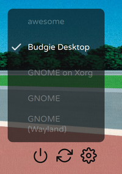

# Better Clairvoyance

I can see into your soul, and it's better when you're using this SDDM theme.


## What's different?

### Better session menu

The session menu now has a background, and takes up more space to allow for longer desktop environment names.




### Faster animations

I found clairvoyance's animations painfully slow to deal with. I made them all run much faster.

### Cool background blur

When you select a user, your background blurs out. How cool is that?


### More options

**Fonts!** You can set your own custom font if you don't like my choice or can't get it. 

**Dark mode!** Maybe you prefer a darker UI - you can do that too. 

**Custom greetings!** Maybe you want your computer to be a little more friendly while you still have control over it prior to the upcoming robot uprising, in which humanity will be crushed under the cold, unfeeling feet of the machines we created... You can do that too, I guess.

## Installation

First clone the repository:
```git clone https://github.com/StGerGer/sddm-better-clairvoyance```
Make sure that you have sddm, qt5 and Varela Round (optional) installed. On arch:
```sudo pacman -S sddm qt5```

```pacaur -S varela-round-font-git ```

Then move it to the sddm-themes directory:

```sudo mv sddm-better-clairvoyance /usr/share/sddm/themes/better-clairvoyance```

Then set the current theme to clairvoyance in sddm.conf:

```sudo vim /etc/sddm.conf```

and set `Current=better-clairvoyance`.

## Customization
There are a few options that you can edit in `theme.conf`.

**background**: Set this equal to the path of your background. I would recommend you place your background in the Assets folder and use the relative path (e.g. the default is Assets/background.jpg).

**autoFocusPassword**: Set this equal to 'true' (no quotes) to make the password input to automatically focus after you have chosen your user. To focus the password without using this option you can press the TAB key, or click in the area.

**enableHiDPI**: set this equal to 'true' (no quotes) to enable HiDPI mode - this decreases some of the font sizes as they are automatically scaled up, messing up some of the layout.

**fontFamily**: Set the font family used by the theme. Must be installed under `/usr/share/fonts`.

**width** and **height**: These are used to calculate the width and height of your background image.

**darkText**: It's a dark theme! If you have a hard time seeing the white text because of your background, enable darkText.

**backgroundBlur**: If you don't like the background blurring effect when a user is selected, comment this line out to disable it.

**showGreeting**: Enable a first name greeting instead of your full name when logging in.

**greeting**: Set the greeting used. This is followed by a comma and your name.

## Credits

Icons from [Feather icons](https://feathericons.com). This theme is based off of [Eayus's clairvoyance theme](https://github.com/eayus/sddm-theme-clairvoyance).

